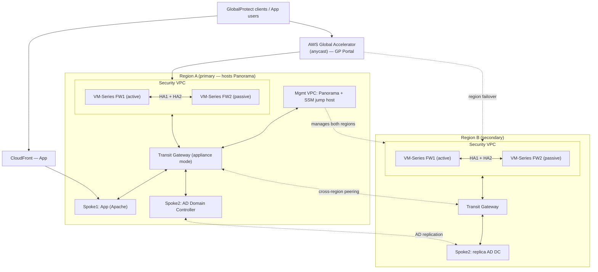

# AWS VM-Series HA — Multi-Region GlobalProtect (Transit VPC)

Terraform IaC that deploys Palo Alto Networks VM-Series firewalls in an
**Active/Passive HA pair per AWS region**, centrally managed by a self-hosted
**Panorama**, to deliver a **resilient, multi-region GlobalProtect Portal + VPN
Gateway**. A **Transit Gateway** in appliance mode provides centralized
east-west and north-south inspection; spoke VPCs host an Apache app and a
Windows Active Directory domain controller (with a replica DC in Region B); and
**AWS Global Accelerator** anycast fronts the portal so clients survive a whole
region outage.

## What it deploys

- **Active/Passive VM-Series HA pair per region** (HA1 control + HA2 state sync)
  with EIP + route-table failover driven by the PAN-OS AWS HA plugin (IAM
  instance profile).
- **Multi-region resilience** via AWS Global Accelerator anycast in front of the
  portal, cross-region Transit Gateway peering, GlobalProtect-native gateway
  failover, and an AD replica DC in Region B for region-outage LDAP/AD
  authentication failover.
- **Centralized inspection with Transit Gateway (appliance mode)** — spoke and
  security VPCs attach to the TGW; route tables force spoke↔spoke and
  spoke↔internet traffic through the firewalls.
- **GlobalProtect Portal + tunnel-mode Gateway** with local or AD/LDAP
  authentication.
- **Windows AD domain controller** in a spoke, with a **replica DC in Region B**.
- **CloudFront** in front of the Apache app.
- **Single Panorama** managing all firewalls in all regions over cross-region
  TGW peering.
- **SSM Session Manager** (via a jump host) for the `panos` provider and XML-API
  automation — no bastion.
- **Optional add-ons:** HTTP→HTTPS redirect ALB, custom domain (Route53
  delegated subdomain + Let's Encrypt wildcard), and an EKS + WordPress + custom
  EDL egress-control stack.

## Failover behavior

- **In-region firewall failover:** on failure of the active unit, the PAN-OS AWS
  HA plugin moves the public EIP and the TGW route to the passive peer
  automatically (EC2 API via the IAM instance profile) — no manual AWS calls,
  transparent to clients.
- **Whole-region failover:** Global Accelerator health-checks the per-region
  portal endpoints and shifts anycast traffic to the surviving region;
  GlobalProtect agents select the best-available gateway natively across regions;
  and the Region B replica DC keeps AD/LDAP authentication available.

## Architecture



## Repo layout

```
main.tf / cross_region.tf   root: 2x module.region_stack (A default, B via aws.region_b) + GA
modules/region_stack/       composes one region from the building-block modules below
modules/{vpc,transit_gateway,bootstrap,panorama,firewall,routing,
         loadbalancer,cloudfront,spoke1_app,spoke2_dc,global_accelerator}
modules/panorama_config/    panos v2 resources (network + policy + GP + EDL)  ── used by ↓
phase2-panorama-config/     separate panos workspace (SSM tunnel; vm-auth-key handoff; commit)
optional/eks-deploy/        EKS + WordPress + custom EDL egress control (aws+helm+kubernetes)
scripts/                    configure/register/marketplace/vm-auth-key/log-collector helpers
docs/                       PREREQUISITES, CONFIGURATION, DEPLOYMENT, ADR, ROADMAP, GP design
```

## Phases (see [docs/ROADMAP.md](docs/ROADMAP.md) for detail)

1a base networking + Panorama · 2a Panorama config (panos workspace, SSM tunnel)
· 1b firewalls + app LB + routing + CloudFront · 2b register FWs · 3 DC ·
GP portal/gateway · R2 Region B + Global Accelerator · optional EKS/WordPress/EDL.

## Deploy (quickstart)

Full runbook with verification, tests, and troubleshooting:
**[docs/DEPLOYMENT.md](docs/DEPLOYMENT.md)**.

```bash
cp terraform.tfvars.example terraform.tfvars   # fill REPLACE_ME
bash scripts/accept-marketplace-terms.sh       # 0. subscribe BYOL AMIs (console)
terraform init

# 1a. base networking + Panorama (region A is module.region_a)
terraform apply \
  -target=module.region_a.module.vpc_security -target=module.region_a.module.vpc_mgmt \
  -target=module.region_a.module.vpc_spoke1   -target=module.region_a.module.vpc_spoke2 \
  -target=module.region_a.module.transit_gateway \
  -target=module.region_a.module.bootstrap -target=module.region_a.module.panorama

# 2a. Panorama config (panos workspace via the SSM tunnel)
bash scripts/configure-panorama.sh tunnel      # keep open in another shell
( cd phase2-panorama-config && terraform init && terraform apply )   # writes vm-auth-key

# 1b. firewalls + app NLB + routing + CloudFront + spoke1 app
terraform apply \
  -target=module.region_a.module.firewall  -target=module.region_a.module.loadbalancer \
  -target=module.region_a.module.routing   -target=module.region_a.module.cloudfront \
  -target=module.region_a.module.spoke1_app

bash scripts/register-fw-panorama.sh           # 2b. register FW serials + commit-all
terraform apply                                # 3/GP/R2: converge (DC, then flags below)
#   GP: enable_globalprotect=true (+ cert) in phase2 and re-apply
#   R2: enable_region_b=true + enable_global_accelerator=true, then apply
```

## Documentation

- **[docs/PREREQUISITES.md](docs/PREREQUISITES.md)** — install tools + log in to AWS from the CLI (do this first).
- **[docs/CONFIGURATION.md](docs/CONFIGURATION.md)** — every parameter: which file, required?, where to source it.
- **[docs/DEPLOYMENT.md](docs/DEPLOYMENT.md)** — the full deploy runbook (phases, verification, tests, teardown, troubleshooting).
- **[docs/ARCHITECTURE-DECISION.md](docs/ARCHITECTURE-DECISION.md)** — the load-bearing design decisions.
- **[docs/ROADMAP.md](docs/ROADMAP.md)** — phased build order.
- **[docs/globalprotect-design.md](docs/globalprotect-design.md)** — GlobalProtect multi-region design.

## Secrets

No secrets are committed. Copy each `*.tfvars.example` to `*.tfvars`
(git-ignored) and fill in your own values; `*.pem` keys are git-ignored too.
